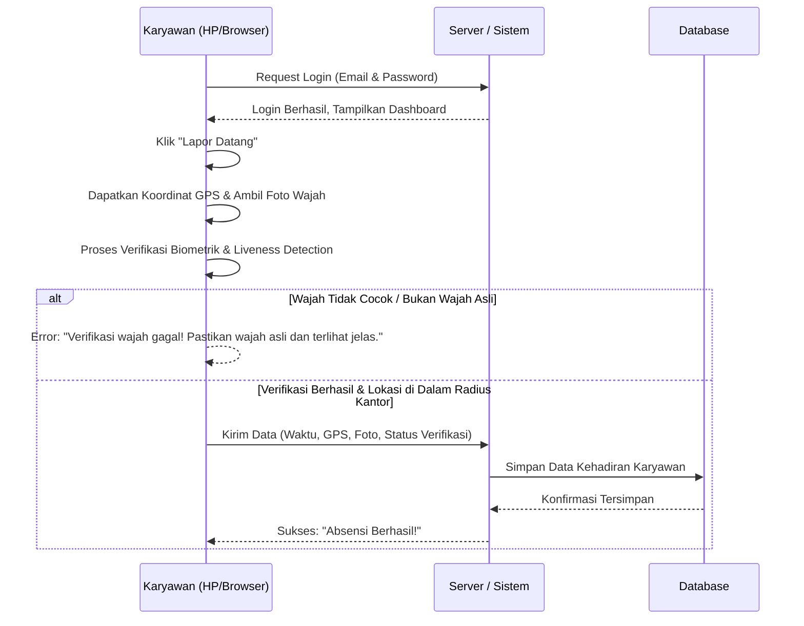
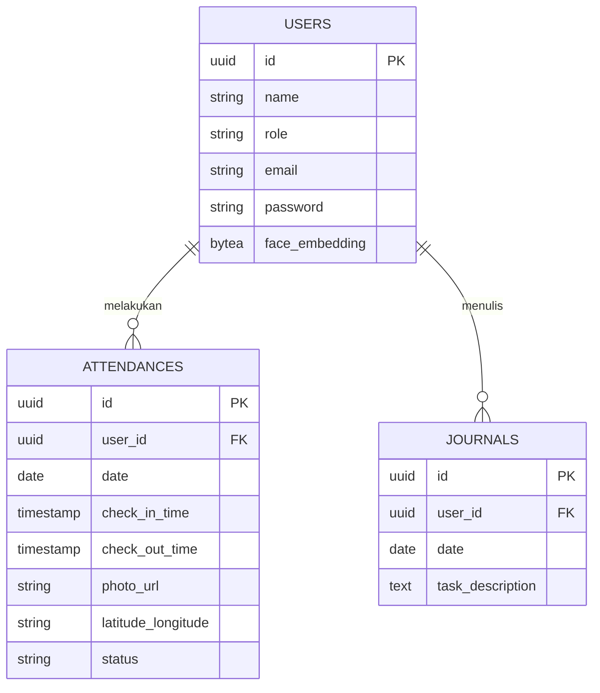

# PRD — Project Requirements Document

## 1. Overview
Aplikasi ini dikembangkan untuk memecahkan masalah pemantauan kehadiran dan kinerja karyawan outsourcing di lingkungan Dinas Kependudukan dan Pencatatan Sipil (Disdukcapil) Kabupaten Murung Raya. Saat ini, pemantauan manual dinilai kurang efektif dan menyulitkan evaluasi harian. 

Tujuan utama dari aplikasi ini adalah menciptakan sistem absensi pintar yang mewajibkan karyawan mencatatkan kehadiran (check-in/check-out) menggunakan foto wajah (*selfie*) dan memvalidasi posisi karyawan agar harus berada di dalam radius kantor (berbasis GPS). Selain itu, aplikasi ini menyediakan fitur "Jurnal Harian" agar karyawan dapat melaporkan pekerjaan mereka, sehingga pihak manajemen (Admin) dapat memantau kehadiran dan produktivitas secara otomatis dan lebih transparan.

## 2. Requirements
- **Akses Perangkat:** Aplikasi harus berbasis web (dapat diakses melalui browser di HP) dengan izin akses mutlak ke Kamera (untuk foto wajah) dan GPS (untuk lokasi).
- **Validasi Radius (Geofencing):** Sistem harus menolak upaya absensi jika koordinat GPS karyawan berada di luar radius kantor Disdukcapil yang telah ditentukan admin.
- **Ketergantungan Harian:** Aplikasi dirancang untuk retensi harian (wajib digunakan setiap hari kerja) mulai dari datang kerja hingga pulang kerja.
- **Keamanan:** Sistem otentikasi yang aman untuk membedakan antara akun Karyawan Biasa dan akun Admin/Pengawas, dilengkapi dengan lapisan verifikasi identitas biometrik untuk mencegah Kecurangan.

## 3. Core Features
- **Presensi Wajah & GPS (Check-in / Check-out):** Tombol lapor datang dan pulang yang secara otomatis menangkap foto wajah dan mencatat titik kordinat lokasi pengguna.
- **Verifikasi Wajah Biometrik:** Sistem akan membandingkan foto *selfie* secara otomatis dengan data wajah master yang terdaftar. Fitur ini mencakup *liveness detection* (mendeteksi tanda-tanda kehidupan seperti gerakan mata atau respons terhadap perubahan cahaya alami) dan teknologi *anti-spoofing* untuk memastikan bahwa wajah yang terfoto adalah wajah asli yang aktif (bukan foto cetak, gambar di layar HP, atau topeng).
- **Jurnal Harian Karyawan:** Formulir sederhana bagi karyawan untuk mengetikkan detail pekerjaan atau tugas apa saja yang telah diselesaikan pada hari tersebut.
- **Cek Riwayat (Untuk Karyawan):** Halaman kalender atau daftar riwayat untuk melihat catatan kehadiran dan jurnal yang pernah diisi oleh karyawan itu sendiri.
- **Dashboard Pemantauan (Untuk Admin):** Halaman khusus pengawas untuk melihat siapa saja yang hadir, absen, telat, beserta foto dan lokasi absensi mereka secara *real-time*.
- **Laporan Otomatis:** Fitur bagi admin untuk mengumpulkan data kehadiran dan jurnal pekerjaan dalam periode tertentu (misal: bulanan) untuk diekspor ke format yang mudah dibaca.

## 4. Technical Specifications
- **Database Engine:** PostgreSQL. Sistem relasional yang andal, mendukung skalabilitas vertikal & horizontal, tipe data spasial (`PostGIS` opsional untuk geofencing lanjut), dan transaksional yang kuat untuk menjaga integritas data absensi dan jurnal.
- **Frontend:** Framework modern (seperti React atau Vue) dengan dukungan **Face-api.js** atau **TensorFlow.js** untuk pemrosesan wajah di browser. Arsitektur ini memungkinkan ekstraksi *face embedding*, *landmark detection*, dan *liveness detection* dilakukan secara lokal di perangkat pengguna, mengurangi latensi dan menghemat bandwidth.
- **Backend:** Node.js (Express/NestJS) atau Python (FastAPI/Flask) untuk menangani logika bisnis, manajemen otentikasi, pengolahan data jurnal, dashboard admin, dan integrasi langsung dengan PostgreSQL. Backend juga akan bertindak sebagai gatekeeper keamanan untuk memvalidasi hasil verifikasi wajah dari frontend dan menghitung jarak geofencing.
- **Geolocation API:** Browser Geolocation API untuk pembacaan koordinat awal di sisi klien, dikombinasikan dengan validasi koordinat di sisi server. Server akan menghitung jarak hipotenus antara titik koordinat karyawan dan titik pusat kantor menggunakan rumus Haversine, memastikan tidak ada manipulasi lokasi via *mock GPS* atau tools pihak ketiga.

## 5. User Flow
**Perjalanan Karyawan (Daily Flow):**
1. Karyawan membuka aplikasi melalui *browser* HP dan melakukan *Login*.
2. Karyawan menekan tombol **"Lapor Datang"**. 
3. Aplikasi meminta akses lokasi & kamera.
4. Jika posisi berada di radius kantor, kamera terbuka. Karyawan mengambil *selfie*.
5. **Secara otomatis, aplikasi melakukan tahap validasi biometrik & *liveness detection*.** Jika wajah cocok dengan data master dan terdeteksi sebagai subjek hidup (bukan foto/layar), proses absensi dilanjutkan. Jika gagal, sistem memberikan peringatan dan meminta pengambilan ulang.
6. Absensi berhasil dicatat dan jam datang tersimpan.
7. Menjelang akhir jam kerja, karyawan membuka menu **"Jurnal Harian"** dan mengetikkan tugas yang diselesaikan hari itu, lalu menyimpannya.
8. Karyawan menekan tombol **"Lapor Pulang"** (menggunakan proses lokasi, foto, dan validasi biometrik yang sama) dan sistem mencatat jam pulang.

**Perjalanan Admin/Pengawas:**
1. Admin *Login* ke aplikasi.
2. Membuka **Dashboard Admin**.
3. Admin melihat tabel rekap kehadiran hari ini secara langsung (termasuk melihat bukti foto dan status lokasi).
4. Admin dapat mengklik profil karyawan untuk melihat Jurnal Harian yang mereka kerjakan.

## 6. Architecture
Berikut adalah gambaran alur sistem ketika karyawan melakukan proses absensi (Lapor Datang).

## 7. Database Schema
Untuk menjalankan aplikasi ini, kita memerlukan tiga tabel/koleksi data utama yang akan di-hosting di PostgreSQL:

1. **Users:** Menyimpan data pengguna (Karyawan dan Admin).
   - `id` (UUID): Pengenal unik pengguna.
   - `name` (VARCHAR): Nama lengkap pengguna.
   - `role` (VARCHAR): Status pengguna (Karyawan / Admin).
   - `email` (VARCHAR): Email untuk login.
   - `password` (VARCHAR): Kata sandi terenkripsi (bcrypt/argon2).
   - `face_embedding` (BYTEA/TEXT): Vektor matematika yang dihasilkan dari AI untuk merepresentasikan fitur unik wajah karyawan, digunakan sebagai acuan perbandingan saat proses *face recognition*.

2. **Attendances:** Menyimpan data absensi/kehadiran harian.
   - `id` (UUID): Pengenal unik absensi.
   - `user_id` (UUID): Relasi ke tabel Users.
   - `date` (DATE): Tanggal absensi (misal: 2023-10-25).
   - `check_in_time` (TIMESTAMP): Waktu lapor datang.
   - `check_out_time` (TIMESTAMP): Waktu lapor pulang.
   - `photo_url` (TEXT): Tautan ke file foto wajah saat absensi.
   - `latitude_longitude` (TEXT/POINT): Titik koordinat lokasi absensi.
   - `status` (VARCHAR): Status kehadiran (Hadir, Telat, Luar Radius, Gagal Verifikasi).

3. **Journals:** Menyimpan laporan pekerjaan harian.
   - `id` (UUID): Pengenal unik jurnal.
   - `user_id` (UUID): Relasi ke tabel Users.
   - `date` (DATE): Tanggal laporan harian dibuat.
   - `task_description` (TEXT): Teks laporan apa saja yang dikerjakan hari ini.

## 8. Tech Stack
Aplikasi ini akan dibangun sebagai Web Application (Responsif untuk HP dan Desktop) dengan menggunakan teknologi modern yang telah disesuaikan dengan spesifikasi teknis:

- **Frontend Framework:** React.js atau Vue.js (untuk antarmuka yang interaktif, component-based, dan mudah diintegrasikan dengan library AI browser).
- **Backend Framework:** Node.js (dengan Express/NestJS) atau Python (FastAPI/Flask) untuk logika bisnis, manajemen autentikasi, dan komunikasi dengan PostgreSQL.
- **Database Engine:** PostgreSQL (Menghubungkan dengan ORM seperti Prisma untuk Node.js atau SQLAlchemy/Tortoise untuk Python).
- **UI/UX Styling:** Tailwind CSS dan component library seperti shadcn/ui atau Ant Design (Memastikan tampilan bersih, profesional, dan responsif di berbagai ukuran layar).
- **AI Komputer Wajah (Client-side):** Face-api.js atau TensorFlow.js (Menjalankan *face recognition*, *landmark detection*, dan *liveness detection* langsung di perangkat pengguna untuk kecepatan dan privasi).
- **API Tambahan (Bawaan Web):** HTML5 Geolocation API (Untuk membaca GPS) dan WebRTC / *input capture* (Untuk mengaktifkan kamera depan HP), dikombinasikan dengan validasi jarak geospasial di sisi server.